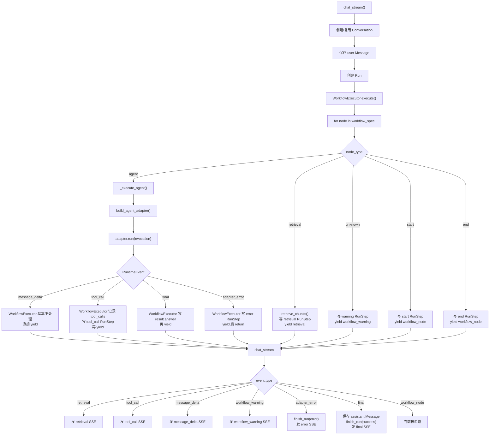

# 后端架构总结

## 一、数据库表关系

```
User ───1:N──→ ModelCredential            owner_user_id FK → users.id

User ───1:N──→ App                         owner_user_id FK → apps.id
                 │
                 ├──1:N──→ AppTool          app_id FK → apps.id
                 │
                 ├──1:N──→ Document         app_id FK → apps.id
                 │            │
                 │            └──1:N──→ DocumentChunk   document_id FK → documents.id
                 │
                 └──1:N──→ Conversation     app_id FK → apps.id
                              │
                              ├──1:N──→ Message         conversation_id FK → conversations.id
                              │
                              └──1:N──→ Run             conversation_id FK → conversations.id
                                          │               app_id FK → apps.id
                                          │               input_message_id FK → messages.id
                                          │               output_message_id FK → messages.id
                                          │
                                          └──1:N──→ RunStep  run_id FK → runs.id
```

### 表间关系说明

- **User → App**：一个用户拥有多个应用。
- **User → ModelCredential**：一个用户持有多个加密的模型 API Key，按 provider 区分。
- **App → AppTool**：一个应用启用哪些内置工具。
- **App → Document → DocumentChunk**：一个应用上传多份文档，每份文档被切分成多个块。
- **App → Conversation**：一个应用下有多段对话。
- **Conversation → Message**：一段对话包含多条消息（user / assistant）。
- **Conversation → Run**：一段对话中每条用户消息触发一次 Run（一次 workflow 执行）。
- **Run → RunStep**：一次 Run 包含多个执行步骤（start → retrieval → tool_call → agent → end），即前端的 trace。
- **Run 的双 FK**：Run 同时持有 `conversation_id` 和 `app_id`。`app_id` 虽然可以通过 `Run → Conversation → App` 间接拿到，但直接存储免去每次按 App 查 Run 时多 JOIN 一张表。
- **Run 的 message FK**：`input_message_id` 指向触发本次执行的用户消息，`output_message_id` 指向本次执行产出的 assistant 消息，实现 Run 与具体 Message 的双向追溯。
- **权限隔离**：Message 查询时 JOIN Conversation 校验 `user_id`，确保用户只能看到自己所属会话的消息。

---

## 二、回调机制 — AgentScope 工具注册与执行链路

### 链路总览

```
agent_adapters.run()
  │
  │  tool_events = []
  │  trace_sink = tool_events.append                        ← 列表的 append 方法作为回调
  │
  └──→ _create_agent(invocation, trace_sink)
         │
         └──→ build_agentscope_toolkit(enabled_tools, trace_sink)
                │
                │  遍历 enabled_tools，dict.fromkeys 去重
                │
                │  对每个 tool_name:
                │    tool_builder = builders[tool_name]        ← 取出对应的 _build_xxx_tool 函数
                │    closure_func = tool_builder(trace_sink)   ← 调用 builder，返回闭包函数
                │    toolkit.register_tool_function(closure_func) ← 注册进 AgentScope，暂不调用
                │
                └──→ 返回 toolkit（含 4 个已注册的闭包函数）

  └──→ stream_printing_messages 运行 ReAct：
         │
         │  AgentScope 决定调用 query_order("10086")
         │    └──→ 闭包 query_order 执行
         │           └──→ _run_agentscope_tool("query_order", {"order_id": "10086"}, trace_sink)
         │                  │
         │                  │  output = run_tool("query_order", {"order_id": "10086"})
         │                  │  trace_sink(event)              ← 同步回调发生！
         │                  │  return ToolResponse(...)
         │
         │  AgentScope 继续推理，可能再调工具，最终产出 final
         │
         └──→ 所有工具调用事件已通过 trace_sink 进入 tool_events 列表
```

### 分阶段详解

#### 阶段一：参数传递（setup 前）

`agent_adapters.run()` 中创建空列表 `tool_events = []`，然后将 `tool_events.append` 作为 `trace_sink` 参数一路传递。`tool_events.append` 是 Python 列表的内置方法，本身是一个可调用对象。

```python
tool_events: list[RuntimeEvent] = []
agent = self._create_agent(invocation, tool_events.append)
```

#### 阶段二：build_agentscope_toolkit — 注册工具函数

```python
def build_agentscope_toolkit(enabled_tools, trace_sink=None):
    toolkit = Toolkit()

    builders = {
        "calculator":   _build_calculator_tool,
        "current_time": _build_current_time_tool,
        "query_order":  _build_query_order_tool,
        "mock_weather": _build_mock_weather_tool,
    }

    for tool_name in dict.fromkeys(enabled_tools):  # dict.fromkeys 去重
        if tool_name not in _TOOL_NAMES:
            continue
        tool_builder = builders.get(tool_name)       # 取出 builder 函数
        if tool_builder:
            toolkit.register_tool_function(
                tool_builder(trace_sink)              # 调用 builder(trace_sink)，得到闭包函数
            )                                         # register_tool_function 解析函数签名并注册

    return toolkit
```

`register_tool_function` 会解析传入函数的签名和 docstring，生成 AgentScope 能理解的工具 schema，存入 `toolkit.tools`。此时仅注册，不执行。

#### 阶段三：四个 builder — 闭包工厂

每个 `_build_xxx_tool(trace_sink)` 接收 `trace_sink`，返回一个**内层函数**。内层函数通过闭包捕获了 `trace_sink`，并拥有明确参数签名，供 AgentScope 在运行时调用：

```python
def _build_calculator_tool(trace_sink):
    def calculator(expression: str):
        """计算简单算式。"""
        arguments = {"expression": expression}
        return _run_agentscope_tool("calculator", arguments, trace_sink)
    return calculator


def _build_current_time_tool(trace_sink):
    def current_time():
        """返回服务器当前时间。"""
        return _run_agentscope_tool("current_time", {}, trace_sink)
    return current_time


def _build_query_order_tool(trace_sink):
    def query_order(order_id: str):
        """查询 mock 电商订单状态。"""
        arguments = {"order_id": order_id}
        return _run_agentscope_tool("query_order", arguments, trace_sink)
    return query_order


def _build_mock_weather_tool(trace_sink):
    def mock_weather(city: str = "上海"):
        """查询 mock 天气。"""
        arguments = {"city": city}
        return _run_agentscope_tool("mock_weather", arguments, trace_sink)
    return mock_weather
```

四个 builder 模式完全一致：
1. 接收 `trace_sink`
2. 定义内层函数，内层函数的参数直接对应 AgentScope 调用时传入的实参
3. 内层函数将自身参数整理成 `arguments` 字典，连同硬编码的 `tool_name` 和闭包中的 `trace_sink` 交给 `_run_agentscope_tool`
4. 返回内层函数

#### 阶段四：_run_agentscope_tool — 回调终点

```python
def _run_agentscope_tool(tool_name, arguments, trace_sink):
    output = run_tool(tool_name, arguments)       # 执行真正的工具逻辑

    event = {
        "type": "tool_call",
        "name": tool_name,
        "input": arguments,
        "output": output,
        "source": "agentscope",
        "latency_ms": int((perf_counter() - started) * 1000),
    }

    if trace_sink:
        trace_sink(event)                         # 同步回调 = tool_events.append(event)

    return ToolResponse(
        content=[TextBlock(type="text", text=json.dumps(output, ensure_ascii=False))]
    )                                             # 返回 AgentScope 能识别的 ToolResponse
```

`trace_sink(event)` 是一个普通的同步函数调用，当场执行。此时 AgentScope 的 ReAct agent 正在阻塞等待工具结果，所以事件立刻进入 `tool_events` 列表。`stream_printing_messages` 吐出下一个 msg 之前，事件已经就位。

### 关键设计点

1. **闭包工厂模式**：`_build_xxx_tool` 不执行工具，而是创建一个带有 `trace_sink` 闭包变量的函数，注册进 AgentScope。AgentScope 在运行时才调用该函数。

2. **同步回调**：`trace_sink(event)` 不是异步的，不依赖线程或定时器。它发生在 AgentScope 调用工具函数的过程中，AgentScope 的 ReAct agent 阻塞等待工具返回，期间事件已同步写入 `tool_events`。

3. **注册与执行分离**：`register_tool_function` 发生在 agent 启动前（setup），工具函数的实际调用发生在 ReAct 推理过程中（runtime）。

4. **去重**：`dict.fromkeys(enabled_tools)` 确保即使 `enabled_tools` 中有重复的工具名，也只会注册一次。

5. **解耦**：工具层（`registry.py`）不直接依赖 `tool_events` 这个变量名，它只认 `trace_sink` 这个函数签名。换成任何其他可调用对象都能工作——比如换成 `print`，事件就会直接打印到控制台。

---

## 三、问题复盘：刷新后聊天记录缺失与 DeepSeek 400

这个问题当时其实处理了两个互相叠在一起的问题。

### 1. 刷新后聊天记录缺失

原因是：后端本来已经有消息落库和查询接口，但前端刷新 / 重新选择 app 后，只恢复了 `runs`，没有根据 `conversation_id` 去拉取 `messages`。

所以我们改了前端三处：

- `frontend/src/types.ts`
  - 给 `RunItem` 增加 `conversation_id`
  - 新增 `MessageItem`

- `frontend/src/api.ts`
  - 新增 `api.listMessages(conversationId)`
  - 调用后端已有的 `/api/conversations/{conversation_id}/messages`

- `frontend/src/main.tsx`
  - 选择 app 时，先拉最近 runs
  - 取最新 run 的 `conversation_id`
  - 再拉这个 conversation 的 messages
  - 映射回 Playground 的 `messages`

这解决的是：**只要 user / assistant 消息已经落库，刷新后前端能恢复出来。**

### 2. 问订单时 400，导致 assistant 没有落库

后来发现：普通聊天能回复，但一问订单就报：

```text
The `reasoning_content` in the thinking mode must be passed back to the API.
```

原因是订单查询触发了 AgentScope ReAct 工具调用：

```text
模型第一次调用 -> 决定调用 query_order
工具执行 -> 模型第二次调用 -> 生成最终回答
```

400 发生在第二次模型调用。因为 DeepSeek 返回了 reasoning / thinking 内容，而我们当时把 DeepSeek 也交给通用 `OpenAIChatFormatter`；这个 formatter 会跳过 thinking block，导致第二次请求没有把 `reasoning_content` 带回去。

所以我们改了后端一处：

- `backend/app/runtime/agent_adapters.py`
  - DeepSeek 相关 provider / model / base_url 改用 AgentScope 自带的 `DeepSeekChatFormatter`
  - 非 DeepSeek 的 OpenAI-compatible 仍然用 `OpenAIChatFormatter`

这解决的是：**订单触发工具后，DeepSeek 的第二轮模型请求不再因为缺 `reasoning_content` 报 400，从而可以正常走到 `final`。**

### 3. 为什么这两个问题会混在一起

`chat_stream()` 的落库逻辑是：

```text
收到用户输入 -> 立刻落库 user message
收到 final -> 才落库 assistant message
```

所以当 400 出现时：

```text
user 已经落库
assistant 没有 final，所以没落库
错误只作为 SSE 临时显示在前端气泡里
刷新后重新从数据库拉 messages
只看到 user，看不到 assistant/400 错误
```

因此看到的现象是：

```text
刷新前：前端临时气泡里有 400
刷新后：400 不见了，只剩用户提问
```

这不是前端单独的问题，也不是后端单独的问题，而是：

```text
前端之前没恢复 messages
+
后端 400 导致没有 final / assistant 没落库
```

我们最终做的是：

```text
前端：刷新后按 latest run 的 conversation_id 拉 messages
后端：DeepSeek 工具调用链路改用 DeepSeekChatFormatter，避免 400
```

当主链路正常时，预期流程就是：

```text
message_delta -> final -> assistant message 落库 -> 刷新后恢复 user + assistant
```

---

## 四、后端 Runtime 链路：chat_service -> workflow -> agentadapter

这个问题的核心是：后端现在其实是一个 **三层事件流架构**。

```text
AgentAdapter
  负责把某个 agent 框架的输出，翻译成 RuntimeEvent

WorkflowExecutor
  负责按 workflow 节点执行，并把 adapter 事件纳入 run trace

chat_stream
  负责把 RuntimeEvent 转成 SSE，同时处理 user/assistant 消息落库和 run 状态
```

这里先不讲前端 UI，只讲后端。

### 1. 三个文件的关系

主要是这三层：

1. `backend/app/runtime/agent_adapters.py`

   定义 adapter 层。

   它把不同 agent runtime 的输出统一翻译成：

   ```python
   RuntimeEvent = dict[str, Any]
   ```

   当前主要事件有：

   ```text
   message_delta
   tool_call
   final
   adapter_error
   ```

2. `backend/app/runtime/workflow_executor.py`

   执行 workflow 节点。

   默认 workflow 是：

   ```text
   start -> retrieval -> react_agent -> end
   ```

   它会执行 start / retrieval / agent / end，并把中间事件继续往上 yield。

3. `backend/app/services/chat_service.py`

   聊天服务层。

   它负责：

   ```text
   创建 conversation
   保存 user message
   创建 run
   调用 WorkflowExecutor
   接收 RuntimeEvent
   final 时保存 assistant message
   把事件包装成 SSE
   ```

### 2. chat_stream 里的 if 判断

在 `chat_stream()` 里，核心循环是：

```python
async for event in executor.execute(query, enabled_tools):
    if event["type"] == "retrieval":
        yield _sse("retrieval", event)

    elif event["type"] == "tool_call":
        yield _sse("tool_call", event)

    elif event["type"] == "message_delta":
        yield _sse("message_delta", {"content": event["content"]})

    elif event["type"] == "workflow_warning":
        yield _sse("workflow_warning", event)

    elif event["type"] == "adapter_error":
        finish_run(..., status="error")
        yield _sse("error", ...)
        break

    elif event["type"] == "final":
        add_message(..., role="assistant")
        finish_run(...)
        yield _sse("final", ...)
```

这层的重点：

```text
retrieval        只转成 SSE
tool_call        只转成 SSE
message_delta    只把 content 转成 SSE
workflow_warning 转成 SSE
adapter_error    标记 run 失败，然后发 error
final            保存 assistant message，结束 run，然后发 final
```

所以真正负责 assistant 落库的是：

```text
chat_stream 收到 final
```

不是 AgentAdapter，也不是 WorkflowExecutor。

另外，`workflow_node` 事件现在会被 `chat_stream()` 忽略。比如 start / end 节点会 yield：

```python
{"type": "workflow_node", ...}
```

但 `chat_stream()` 没有对应 `if`，所以不会发出去。

### 3. WorkflowExecutor 里的第一个 for 循环

在 `WorkflowExecutor.execute()` 里：

```python
for node in self._ordered_nodes(self.app.workflow_spec):
    node_type = self._normalize_type(node.get("type", ""))

    if node_type == "start":
        yield start event

    elif node_type == "retrieval":
        yield retrieval event

    elif node_type == "agent":
        async for event in self._execute_agent(...):
            yield event

    elif node_type == "end":
        yield end event

    else:
        yield workflow_warning
```

这层是 workflow 节点调度器。

默认情况下：

```text
start      -> 生成 workflow_node，但 chat_stream 忽略
retrieval  -> 生成 retrieval，chat_stream 会转发
agent      -> 进入 AgentAdapter，产生 message_delta/tool_call/final 等
end        -> 生成 workflow_node，但 chat_stream 忽略
```

注意：现在默认 workflow 里没有 workflow-level `tool` 节点。所以工具调用主要发生在 agent 内部，不是 workflow 节点本身。

### 4. WorkflowExecutor 的 adapter 事件循环

在 `_execute_agent()` 里：

```python
async for event in adapter.run(invocation):
    if event["type"] == "tool_call":
        self.result.tool_calls.append(event)
        add_step(...)

    elif event["type"] == "final":
        final_answer = str(event.get("content", ""))
        self.result.answer = final_answer

    elif event["type"] == "adapter_error":
        add_step(...)
        yield event
        return

    yield event
```

这段非常关键。

它对 adapter 事件做了三类处理：

```text
tool_call
  记录到 self.result.tool_calls
  写 RunStep
  然后继续 yield 给 chat_stream

final
  更新 self.result.answer
  然后继续 yield 给 chat_stream

adapter_error
  写 error RunStep
  yield 给 chat_stream
  return，停止 agent 节点
```

其他事件，比如：

```text
message_delta
```

没有特殊处理，直接：

```python
yield event
```

所以 `message_delta` 基本是从 adapter 穿过 WorkflowExecutor 到 chat_stream。

### 5. AgentScopeAdapter 里的 for 循环

在 `AgentScopeAdapter.run()` 里，核心是：

```python
async for msg, last in stream_printing_messages(...):
    while tool_events:
        yield tool_events.pop(0)

    current = self._extract_text(msg)
    delta = ...

    if delta:
        yield {
            "type": "message_delta",
            "content": delta,
            "source": "agentscope",
        }

    if last:
        while tool_events:
            yield tool_events.pop(0)
```

这层做的是 AgentScope -> RuntimeEvent 的翻译。

它主要产生：

```text
message_delta
tool_call
final
adapter_error
```

其中 `tool_call` 很特殊。

AgentScope 内部工具调用不是 `stream_printing_messages()` 直接吐出来的，而是工具函数执行时通过 `trace_sink` 塞进：

```python
tool_events: list[RuntimeEvent] = []
```

工具调用链路是：

```text
AgentScope ReActAgent 决定调用工具
-> build_agentscope_toolkit 注册的工具函数被调用
-> 工具函数执行 run_tool()
-> trace_sink(event)
-> event 被塞进 tool_events
-> AgentScopeAdapter.run() 在 while tool_events 里 yield 出来
```

所以 tool_call 是一种“旁路收集，再并入主事件流”的事件。

### 6. 哪些是逐层传递，哪些是穿透

可以这样分。

#### 逐层处理型：retrieval

来源：

```text
WorkflowExecutor._execute_retrieval()
```

流向：

```text
WorkflowExecutor 生成
-> chat_stream 接收
-> 转成 SSE
```

中间没有 adapter。

#### 逐层处理型：final

来源：

```text
AgentAdapter
```

流向：

```text
AgentAdapter 生成 final
-> WorkflowExecutor 记录 self.result.answer
-> chat_stream 保存 assistant message
-> chat_stream finish_run
-> chat_stream 发 final SSE
```

这是逐层处理，且每层都有业务动作。

#### 逐层处理型：adapter_error

来源：

```text
AgentAdapter
```

流向：

```text
AgentAdapter 生成 adapter_error
-> WorkflowExecutor 写 error step
-> chat_stream finish_run(status="error")
-> chat_stream 发 error SSE
```

也是逐层处理。

#### 半穿透型：tool_call

来源：

```text
AgentScope 内部工具函数
```

流向：

```text
AgentScope 工具函数
-> trace_sink 塞进 AgentScopeAdapter.tool_events
-> AgentScopeAdapter yield tool_call
-> WorkflowExecutor 记录 tool_calls + 写 RunStep
-> chat_stream 原样转 SSE
```

它不是 workflow 节点生成的，所以从“业务来源”看，它穿透了 workflow 节点编排；但它并不是完全绕过 WorkflowExecutor，因为 WorkflowExecutor 仍然接到了它，并写了 trace。

#### 接近完全穿透型：message_delta

来源：

```text
AgentAdapter
```

流向：

```text
AgentAdapter yield message_delta
-> WorkflowExecutor 不加工，直接 yield
-> chat_stream 只取 content 发 SSE
```

WorkflowExecutor 不保存、不聚合、不写 step。它只是通道。

#### 被吞掉型：workflow_node

来源：

```text
start/end 节点
```

流向：

```text
WorkflowExecutor yield workflow_node
-> chat_stream 没有对应 if
-> 不发 SSE
```

### 7. 数据流图



### 8. 如果换 LangChain / LangGraph adapter 怎么做

原则上不用改 `chat_stream()`，也尽量不要改 `WorkflowExecutor`。

要做的是新增一个 adapter，实现同一个接口：

```python
class LangGraphAgentAdapter(BaseAgentAdapter):
    name = "langgraph"

    async def run(self, invocation: AgentInvocation) -> AsyncIterator[RuntimeEvent]:
        ...
        yield {"type": "message_delta", "content": "...", "source": "langgraph"}
        yield {"type": "tool_call", "name": "...", "input": {...}, "output": {...}, "source": "langgraph"}
        yield {"type": "final", "content": "...", "source": "langgraph"}
```

然后在：

```python
build_agent_adapter(adapter_name, model_provider)
```

里支持：

```python
if selected == "langgraph":
    return LangGraphAgentAdapter()
```

LangChain / LangGraph 内部的事件格式肯定不一样，但 adapter 要把它们统一翻译成项目自己的 `RuntimeEvent`。

也就是说：

```text
LangGraph event / LangChain callback
-> LangGraphAgentAdapter 翻译
-> RuntimeEvent
-> WorkflowExecutor
-> chat_stream
```

工具调用也一样。

如果 LangGraph 自己执行工具，它也要在 adapter 里转成：

```python
{
    "type": "tool_call",
    "name": tool_name,
    "input": input_args,
    "output": tool_output,
    "source": "langgraph",
}
```

这样 WorkflowExecutor 就仍然可以：

```text
记录 tool_calls
写 RunStep
继续 yield 给 chat_stream
```

### 9. 最重要的一句话

现在后端真正的内部协议不是 AgentScope，也不是 SSE，而是：

```text
RuntimeEvent
```

只要新的 adapter 能稳定产出这些事件：

```text
message_delta
tool_call
final
adapter_error
```

那么：

```text
WorkflowExecutor 不需要知道底层是 AgentScope / LangChain / LangGraph
chat_stream 也不需要知道底层是哪个框架
```

这就是 adapter 层的价值。
