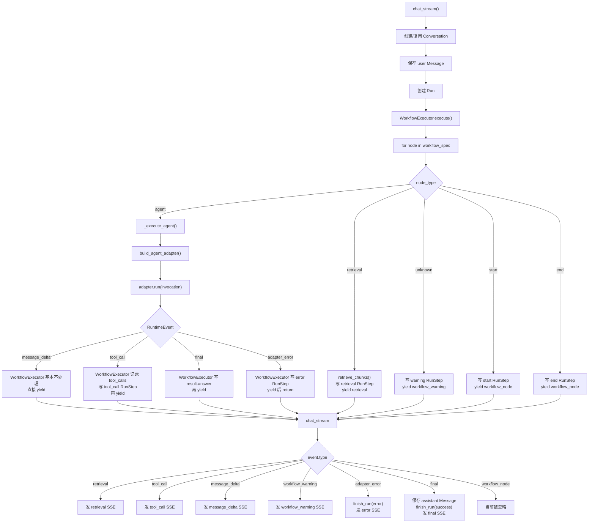

# 后端架构总结

## 一、数据库表关系

```
User ───1:N──→ ModelCredential              owner_user_id → users.id

User ───1:N──→ App                          owner_user_id → users.id
                 │
                 ├──1:N──→ AppTool           app_id FK → apps.id
                 │
                 ├──1:N──→ Conversation      app_id FK → apps.id
                 │            │
                 │            └──1:N──→ Message          conversation_id FK → conversations.id
                 │
                 └──1:N──→ Run               app_id FK → apps.id
                              │               conversation_id FK → conversations.id
                              │               input_message_id → messages.id
                              │               output_message_id → messages.id
                              │
                              └──1:N──→ RunStep           run_id FK → runs.id


User ───1:N──→ KnowledgeBase                owner_user_id → users.id
                 │
                 ├──1:N──→ KnowledgeDocument knowledge_base_id FK → knowledge_bases.id
                 │            │
                 │            └──1:N──→ KnowledgeChunk    document_id FK → knowledge_documents.id
                 │
                 └──1:N──→ KnowledgeChunk    knowledge_base_id FK → knowledge_bases.id

```

### 表间关系说明

- **Run 的双 FK**：Run 同时持有 `conversation_id` 和 `app_id`。`app_id` 虽然可以通过 `Run → Conversation → App` 间接拿到，但直接存储免去每次按 App 查 Run 时多 JOIN 一张表。
- **Run 的 message FK**：`input_message_id` 指向触发本次执行的用户消息，`output_message_id` 指向本次执行产出的 assistant 消息，实现 Run 与具体 Message 的双向追溯。
- **权限隔离**：Message 查询时 JOIN Conversation 校验 `user_id`，确保用户只能看到自己所属会话的消息。
- **chunk**：因为 KnowledgeChunk 同时需要回答两个问题：这个 chunk 属于哪个文档？这个 chunk 属于哪个知识库？所以它同时保存了 knowledge_base_id 和 document_id
---

## 二、回调机制 — AgentScope 工具注册与执行链路

### 链路总览

```
agent_adapters.run()
  │
  │  tool_events = []
  │  trace_sink = tool_events.append                        ← 列表的 append 方法作为回调
  │
  └──→ _create_agent(invocation, trace_sink)
         │
         └──→ build_agentscope_toolkit(enabled_tools, trace_sink)
                │
                │  遍历 enabled_tools，dict.fromkeys 去重
                │
                │  对每个 tool_name:
                │    tool_builder = builders[tool_name]        ← 取出对应的 _build_xxx_tool 函数
                │    closure_func = tool_builder(trace_sink)   ← 调用 builder，返回闭包函数
                │    toolkit.register_tool_function(closure_func) ← 注册进 AgentScope，暂不调用
                │
                └──→ 返回 toolkit（含 4 个已注册的闭包函数）

  └──→ stream_printing_messages 运行 ReAct：
         │
         │  AgentScope 决定调用 query_order("10086")
         │    └──→ 闭包 query_order 执行
         │           └──→ _run_agentscope_tool("query_order", {"order_id": "10086"}, trace_sink)
         │                  │
         │                  │  output = run_tool("query_order", {"order_id": "10086"})
         │                  │  trace_sink(event)              ← 同步回调发生！
         │                  │  return ToolResponse(...)
         │
         │  AgentScope 继续推理，可能再调工具，最终产出 final
         │
         └──→ 所有工具调用事件已通过 trace_sink 进入 tool_events 列表
```

### 分阶段详解

#### 阶段一：参数传递（setup 前）

`agent_adapters.run()` 中创建空列表 `tool_events = []`，然后将 `tool_events.append` 作为 `trace_sink` 参数一路传递。`tool_events.append` 是 Python 列表的内置方法，本身是一个可调用对象。

```python
tool_events: list[RuntimeEvent] = []
agent = self._create_agent(invocation, tool_events.append)
```

#### 阶段二：build_agentscope_toolkit — 注册工具函数

```python
def build_agentscope_toolkit(enabled_tools, trace_sink=None):
    toolkit = Toolkit()

    builders = {
        "calculator":   _build_calculator_tool,
        "current_time": _build_current_time_tool,
        "query_order":  _build_query_order_tool,
        "mock_weather": _build_mock_weather_tool,
    }

    for tool_name in dict.fromkeys(enabled_tools):  # dict.fromkeys 去重
        if tool_name not in _TOOL_NAMES:
            continue
        tool_builder = builders.get(tool_name)       # 取出 builder 函数
        if tool_builder:
            toolkit.register_tool_function(
                tool_builder(trace_sink)              # 调用 builder(trace_sink)，得到闭包函数
            )                                         # register_tool_function 解析函数签名并注册

    return toolkit
```

`register_tool_function` 会解析传入函数的签名和 docstring，生成 AgentScope 能理解的工具 schema，存入 `toolkit.tools`。此时仅注册，不执行。

#### 阶段三：四个 builder — 闭包工厂

每个 `_build_xxx_tool(trace_sink)` 接收 `trace_sink`，返回一个**内层函数**。内层函数通过闭包捕获了 `trace_sink`，并拥有明确参数签名，供 AgentScope 在运行时调用：

```python
def _build_calculator_tool(trace_sink):
    def calculator(expression: str):
        """计算简单算式。"""
        arguments = {"expression": expression}
        return _run_agentscope_tool("calculator", arguments, trace_sink)
    return calculator


def _build_current_time_tool(trace_sink):
    def current_time():
        """返回服务器当前时间。"""
        return _run_agentscope_tool("current_time", {}, trace_sink)
    return current_time


def _build_query_order_tool(trace_sink):
    def query_order(order_id: str):
        """查询 mock 电商订单状态。"""
        arguments = {"order_id": order_id}
        return _run_agentscope_tool("query_order", arguments, trace_sink)
    return query_order


def _build_mock_weather_tool(trace_sink):
    def mock_weather(city: str = "上海"):
        """查询 mock 天气。"""
        arguments = {"city": city}
        return _run_agentscope_tool("mock_weather", arguments, trace_sink)
    return mock_weather
```

四个 builder 模式完全一致：
1. 接收 `trace_sink`
2. 定义内层函数，内层函数的参数直接对应 AgentScope 调用时传入的实参
3. 内层函数将自身参数整理成 `arguments` 字典，连同硬编码的 `tool_name` 和闭包中的 `trace_sink` 交给 `_run_agentscope_tool`
4. 返回内层函数

#### 阶段四：_run_agentscope_tool — 回调终点

```python
def _run_agentscope_tool(tool_name, arguments, trace_sink):
    output = run_tool(tool_name, arguments)       # 执行真正的工具逻辑

    event = {
        "type": "tool_call",
        "name": tool_name,
        "input": arguments,
        "output": output,
        "source": "agentscope",
        "latency_ms": int((perf_counter() - started) * 1000),
    }

    if trace_sink:
        trace_sink(event)                         # 同步回调 = tool_events.append(event)

    return ToolResponse(
        content=[TextBlock(type="text", text=json.dumps(output, ensure_ascii=False))]
    )                                             # 返回 AgentScope 能识别的 ToolResponse
```

`trace_sink(event)` 是一个普通的同步函数调用，当场执行。此时 AgentScope 的 ReAct agent 正在阻塞等待工具结果，所以事件立刻进入 `tool_events` 列表。`stream_printing_messages` 吐出下一个 msg 之前，事件已经就位。

### 关键设计点

1. **闭包工厂模式**：`_build_xxx_tool` 不执行工具，而是创建一个带有 `trace_sink` 闭包变量的函数，注册进 AgentScope。AgentScope 在运行时才调用该函数。

2. **同步回调**：`trace_sink(event)` 不是异步的，不依赖线程或定时器。它发生在 AgentScope 调用工具函数的过程中，AgentScope 的 ReAct agent 阻塞等待工具返回，期间事件已同步写入 `tool_events`。

3. **注册与执行分离**：`register_tool_function` 发生在 agent 启动前（setup），工具函数的实际调用发生在 ReAct 推理过程中（runtime）。

4. **去重**：`dict.fromkeys(enabled_tools)` 确保即使 `enabled_tools` 中有重复的工具名，也只会注册一次。

5. **解耦**：工具层（`registry.py`）不直接依赖 `tool_events` 这个变量名，它只认 `trace_sink` 这个函数签名。换成任何其他可调用对象都能工作——比如换成 `print`，事件就会直接打印到控制台。

---

## 三、问题复盘：刷新后聊天记录缺失与 DeepSeek 400

这个问题当时其实处理了两个互相叠在一起的问题。

### 1. 刷新后聊天记录缺失

原因是：后端本来已经有消息落库和查询接口，但前端刷新 / 重新选择 app 后，只恢复了 `runs`，没有根据 `conversation_id` 去拉取 `messages`。

所以我们改了前端三处：

- `frontend/src/types.ts`
  - 给 `RunItem` 增加 `conversation_id`
  - 新增 `MessageItem`

- `frontend/src/api.ts`
  - 新增 `api.listMessages(conversationId)`
  - 调用后端已有的 `/api/conversations/{conversation_id}/messages`

- `frontend/src/main.tsx`
  - 选择 app 时，先拉最近 runs
  - 取最新 run 的 `conversation_id`
  - 再拉这个 conversation 的 messages
  - 映射回 Playground 的 `messages`

这解决的是：**只要 user / assistant 消息已经落库，刷新后前端能恢复出来。**

### 2. 问订单时 400，导致 assistant 没有落库

后来发现：普通聊天能回复，但一问订单就报：

```text
The `reasoning_content` in the thinking mode must be passed back to the API.
```

原因是订单查询触发了 AgentScope ReAct 工具调用：

```text
模型第一次调用 -> 决定调用 query_order
工具执行 -> 模型第二次调用 -> 生成最终回答
```

400 发生在第二次模型调用。因为 DeepSeek 返回了 reasoning / thinking 内容，而我们当时把 DeepSeek 也交给通用 `OpenAIChatFormatter`；这个 formatter 会跳过 thinking block，导致第二次请求没有把 `reasoning_content` 带回去。

所以我们改了后端一处：

- `backend/app/runtime/agent_adapters.py`
  - DeepSeek 相关 provider / model / base_url 改用 AgentScope 自带的 `DeepSeekChatFormatter`
  - 非 DeepSeek 的 OpenAI-compatible 仍然用 `OpenAIChatFormatter`

这解决的是：**订单触发工具后，DeepSeek 的第二轮模型请求不再因为缺 `reasoning_content` 报 400，从而可以正常走到 `final`。**

### 3. 为什么这两个问题会混在一起

`chat_stream()` 的落库逻辑是：

```text
收到用户输入 -> 立刻落库 user message
收到 final -> 才落库 assistant message
```

所以当 400 出现时：

```text
user 已经落库
assistant 没有 final，所以没落库
错误只作为 SSE 临时显示在前端气泡里
刷新后重新从数据库拉 messages
只看到 user，看不到 assistant/400 错误
```

因此看到的现象是：

```text
刷新前：前端临时气泡里有 400
刷新后：400 不见了，只剩用户提问
```

这不是前端单独的问题，也不是后端单独的问题，而是：

```text
前端之前没恢复 messages
+
后端 400 导致没有 final / assistant 没落库
```

我们最终做的是：

```text
前端：刷新后按 latest run 的 conversation_id 拉 messages
后端：DeepSeek 工具调用链路改用 DeepSeekChatFormatter，避免 400
```

当主链路正常时，预期流程就是：

```text
message_delta -> final -> assistant message 落库 -> 刷新后恢复 user + assistant
```

---

## 四、后端 Runtime 链路：chat_service -> workflow -> agentadapter

这个问题的核心是：后端现在其实是一个 **三层事件流架构**。

```text
AgentAdapter
  负责把某个 agent 框架的输出，翻译成 RuntimeEvent

WorkflowExecutor
  负责按 workflow 节点执行，并把 adapter 事件纳入 run trace

chat_stream
  负责把 RuntimeEvent 转成 SSE，同时处理 user/assistant 消息落库和 run 状态
```

这里先不讲前端 UI，只讲后端。

### 1. 三个文件的关系

主要是这三层：

1. `backend/app/runtime/agent_adapters.py`

   定义 adapter 层。

   它把不同 agent runtime 的输出统一翻译成：

   ```python
   RuntimeEvent = dict[str, Any]
   ```

   当前主要事件有：

   ```text
   message_delta
   tool_call
   final
   adapter_error
   ```

2. `backend/app/runtime/workflow_executor.py`

   执行 workflow 节点。

   默认 workflow 是：

   ```text
   start -> retrieval -> react_agent -> end
   ```

   它会执行 start / retrieval / agent / end，并把中间事件继续往上 yield。

3. `backend/app/services/chat_service.py`

   聊天服务层。

   它负责：

   ```text
   创建 conversation
   保存 user message
   创建 run
   调用 WorkflowExecutor
   接收 RuntimeEvent
   final 时保存 assistant message
   把事件包装成 SSE
   ```

### 2. chat_stream 里的 if 判断

在 `chat_stream()` 里，核心循环是：

```python
async for event in executor.execute(query, enabled_tools):
    if event["type"] == "retrieval":
        yield _sse("retrieval", event)

    elif event["type"] == "tool_call":
        yield _sse("tool_call", event)

    elif event["type"] == "message_delta":
        yield _sse("message_delta", {"content": event["content"]})

    elif event["type"] == "workflow_warning":
        yield _sse("workflow_warning", event)

    elif event["type"] == "adapter_error":
        finish_run(..., status="error")
        yield _sse("error", ...)
        break

    elif event["type"] == "final":
        add_message(..., role="assistant")
        finish_run(...)
        yield _sse("final", ...)
```

这层的重点：

```text
retrieval        只转成 SSE
tool_call        只转成 SSE
message_delta    只把 content 转成 SSE
workflow_warning 转成 SSE
adapter_error    标记 run 失败，然后发 error
final            保存 assistant message，结束 run，然后发 final
```

所以真正负责 assistant 落库的是：

```text
chat_stream 收到 final
```

不是 AgentAdapter，也不是 WorkflowExecutor。

另外，`workflow_node` 事件现在会被 `chat_stream()` 忽略。比如 start / end 节点会 yield：

```python
{"type": "workflow_node", ...}
```

但 `chat_stream()` 没有对应 `if`，所以不会发出去。

### 3. WorkflowExecutor 里的第一个 for 循环

在 `WorkflowExecutor.execute()` 里：

```python
for node in self._ordered_nodes(self.app.workflow_spec):
    node_type = self._normalize_type(node.get("type", ""))

    if node_type == "start":
        yield start event

    elif node_type == "retrieval":
        yield retrieval event

    elif node_type == "agent":
        async for event in self._execute_agent(...):
            yield event

    elif node_type == "end":
        yield end event

    else:
        yield workflow_warning
```

这层是 workflow 节点调度器。

默认情况下：

```text
start      -> 生成 workflow_node，但 chat_stream 忽略
retrieval  -> 生成 retrieval，chat_stream 会转发
agent      -> 进入 AgentAdapter，产生 message_delta/tool_call/final 等
end        -> 生成 workflow_node，但 chat_stream 忽略
```

注意：现在默认 workflow 里没有 workflow-level `tool` 节点。所以工具调用主要发生在 agent 内部，不是 workflow 节点本身。

### 4. WorkflowExecutor 的 adapter 事件循环

在 `_execute_agent()` 里：

```python
async for event in adapter.run(invocation):
    if event["type"] == "tool_call":
        self.result.tool_calls.append(event)
        add_step(...)

    elif event["type"] == "final":
        final_answer = str(event.get("content", ""))
        self.result.answer = final_answer

    elif event["type"] == "adapter_error":
        add_step(...)
        yield event
        return

    yield event
```

这段非常关键。

它对 adapter 事件做了三类处理：

```text
tool_call
  记录到 self.result.tool_calls
  写 RunStep
  然后继续 yield 给 chat_stream

final
  更新 self.result.answer
  然后继续 yield 给 chat_stream

adapter_error
  写 error RunStep
  yield 给 chat_stream
  return，停止 agent 节点
```

其他事件，比如：

```text
message_delta
```

没有特殊处理，直接：

```python
yield event
```

所以 `message_delta` 基本是从 adapter 穿过 WorkflowExecutor 到 chat_stream。

### 5. AgentScopeAdapter 里的 for 循环

在 `AgentScopeAdapter.run()` 里，核心是：

```python
async for msg, last in stream_printing_messages(...):
    while tool_events:
        yield tool_events.pop(0)

    current = self._extract_text(msg)
    delta = ...

    if delta:
        yield {
            "type": "message_delta",
            "content": delta,
            "source": "agentscope",
        }

    if last:
        while tool_events:
            yield tool_events.pop(0)
```

这层做的是 AgentScope -> RuntimeEvent 的翻译。

它主要产生：

```text
message_delta
tool_call
final
adapter_error
```

其中 `tool_call` 很特殊。

AgentScope 内部工具调用不是 `stream_printing_messages()` 直接吐出来的，而是工具函数执行时通过 `trace_sink` 塞进：

```python
tool_events: list[RuntimeEvent] = []
```

工具调用链路是：

```text
AgentScope ReActAgent 决定调用工具
-> build_agentscope_toolkit 注册的工具函数被调用
-> 工具函数执行 run_tool()
-> trace_sink(event)
-> event 被塞进 tool_events
-> AgentScopeAdapter.run() 在 while tool_events 里 yield 出来
```

所以 tool_call 是一种“旁路收集，再并入主事件流”的事件。

### 6. 哪些是逐层传递，哪些是穿透

可以这样分。

#### 逐层处理型：retrieval

来源：

```text
WorkflowExecutor._execute_retrieval()
```

流向：

```text
WorkflowExecutor 生成
-> chat_stream 接收
-> 转成 SSE
```

中间没有 adapter。

#### 逐层处理型：final

来源：

```text
AgentAdapter
```

流向：

```text
AgentAdapter 生成 final
-> WorkflowExecutor 记录 self.result.answer
-> chat_stream 保存 assistant message
-> chat_stream finish_run
-> chat_stream 发 final SSE
```

这是逐层处理，且每层都有业务动作。

#### 逐层处理型：adapter_error

来源：

```text
AgentAdapter
```

流向：

```text
AgentAdapter 生成 adapter_error
-> WorkflowExecutor 写 error step
-> chat_stream finish_run(status="error")
-> chat_stream 发 error SSE
```

也是逐层处理。

#### 半穿透型：tool_call

来源：

```text
AgentScope 内部工具函数
```

流向：

```text
AgentScope 工具函数
-> trace_sink 塞进 AgentScopeAdapter.tool_events
-> AgentScopeAdapter yield tool_call
-> WorkflowExecutor 记录 tool_calls + 写 RunStep
-> chat_stream 原样转 SSE
```

它不是 workflow 节点生成的，所以从“业务来源”看，它穿透了 workflow 节点编排；但它并不是完全绕过 WorkflowExecutor，因为 WorkflowExecutor 仍然接到了它，并写了 trace。

#### 接近完全穿透型：message_delta

来源：

```text
AgentAdapter
```

流向：

```text
AgentAdapter yield message_delta
-> WorkflowExecutor 不加工，直接 yield
-> chat_stream 只取 content 发 SSE
```

WorkflowExecutor 不保存、不聚合、不写 step。它只是通道。

#### 被吞掉型：workflow_node

来源：

```text
start/end 节点
```

流向：

```text
WorkflowExecutor yield workflow_node
-> chat_stream 没有对应 if
-> 不发 SSE
```

### 7. 数据流图



### 8. 如果换 LangChain / LangGraph adapter 怎么做

原则上不用改 `chat_stream()`，也尽量不要改 `WorkflowExecutor`。

要做的是新增一个 adapter，实现同一个接口：

```python
class LangGraphAgentAdapter(BaseAgentAdapter):
    name = "langgraph"

    async def run(self, invocation: AgentInvocation) -> AsyncIterator[RuntimeEvent]:
        ...
        yield {"type": "message_delta", "content": "...", "source": "langgraph"}
        yield {"type": "tool_call", "name": "...", "input": {...}, "output": {...}, "source": "langgraph"}
        yield {"type": "final", "content": "...", "source": "langgraph"}
```

然后在：

```python
build_agent_adapter(adapter_name, model_provider)
```

里支持：

```python
if selected == "langgraph":
    return LangGraphAgentAdapter()
```

LangChain / LangGraph 内部的事件格式肯定不一样，但 adapter 要把它们统一翻译成项目自己的 `RuntimeEvent`。

也就是说：

```text
LangGraph event / LangChain callback
-> LangGraphAgentAdapter 翻译
-> RuntimeEvent
-> WorkflowExecutor
-> chat_stream
```

工具调用也一样。

如果 LangGraph 自己执行工具，它也要在 adapter 里转成：

```python
{
    "type": "tool_call",
    "name": tool_name,
    "input": input_args,
    "output": tool_output,
    "source": "langgraph",
}
```

这样 WorkflowExecutor 就仍然可以：

```text
记录 tool_calls
写 RunStep
继续 yield 给 chat_stream
```

### 9. 最重要的一句话

现在后端真正的内部协议不是 AgentScope，也不是 SSE，而是：

```text
RuntimeEvent
```

只要新的 adapter 能稳定产出这些事件：

```text
message_delta
tool_call
final
adapter_error
```

那么：

```text
WorkflowExecutor 不需要知道底层是 AgentScope / LangChain / LangGraph
chat_stream 也不需要知道底层是哪个框架
```

这就是 adapter 层的价值。

---

## 五、当前 Sparse 方案与完整检索流程

这一节记录当前代码里的真实实现，主要对应：

- `backend/app/services/retrieval_service.py`
- `backend/app/services/retrieval_defaults.py`
- `backend/app/services/sparse_bm25.py`
- `backend/app/services/knowledge_database_service.py`
- `backend/app/services/qdrant_service.py`

### 1. Sparse 总体方案

当前 sparse 采用后端固定的 BM25-like sparse vector 方案：

```text
BM25-like sparse vector
+ jieba 中文分词
+ 英文/数字正则 token
+ 内置停用词表
+ Qdrant native sparse index
+ Postgres 本地 BM25-like fallback
```

它走词项匹配路线，依赖本地 tokenizer、停用词表和 BM25-like 权重；文档侧 sparse vector 存入 Qdrant sparse index，检索侧用 query sparse vector 做词项匹配。

当前固定默认值在 `retrieval_defaults.py`：

```python
DEFAULT_SPARSE_WEIGHTING = "bm25_like"
DEFAULT_SPARSE_TOKENIZER = "jieba_v1"
DEFAULT_SPARSE_STOPWORDS_ENABLED = True
DEFAULT_BM25_K1 = 1.5
DEFAULT_BM25_B = 0.75
DEFAULT_SPARSE_MIN_SCORE = 0.0
DEFAULT_SPARSE_CANDIDATE_TOP_K = 50
DEFAULT_RRF_SPARSE_WEIGHT = 0.3
```

这些值是后端固定策略，不从 workflow retrieval node 暴露给用户配置。

### 2. Sparse tokenization

统一入口是 `tokenize_for_sparse(text)`。

处理流程是：

```text
原始文本
-> str(text or "").lower()
-> 英文/数字/下划线：正则 [a-z0-9_]+ 提取
-> 如果文本里有中文字符：jieba.lcut(value, HMM=True)
-> token 两侧标点清理
-> 过滤空 token
-> 过滤内置中英文停用词
-> 过滤不含英文、数字、下划线或中文字符的 token
-> 返回 token list
```

英文、数字 token 会继续保留，例如代码文档里的 `postgres`、`qdrant`、`embedding_3`、`api` 这类词都可以进入 sparse。

中文使用 `jieba.lcut(..., HMM=True)` 做词级切分。例如“数学建模课程总结”会尽量产生“数学建模 / 课程 / 总结”这类词级 token。

### 3. 文档侧 BM25-like sparse vector

文档入库时，只有可检索 chunk 参与 sparse index：

```text
chunk_type != "parent"
+ content 非空
+ chunk 有 qdrant_point_id
```

parent chunk 不参与 sparse index。parent-child 开启时，检索先命中 child/text chunk，后面再做 parent expansion。

文档侧 sparse vector 的计算流程是：

```text
当前 KB 下所有可 sparse 检索 chunks
-> 对每个 chunk 做 tokenize_for_sparse()
-> 统计 KB 级 corpus stats:
   - N: 文档/chunk 数
   - df: 每个 token 出现在多少个 chunk 中
   - avgdl: 平均 chunk token 长度
-> 对每个 chunk 计算 BM25-like token 权重
-> token 通过 blake2b 稳定 hash 成 Qdrant sparse index
-> 写入 Qdrant sparse vector
```

文档侧权重公式是：

```text
idf = log(1 + (N - df + 0.5) / (df + 0.5))

value =
  idf * (tf * (k1 + 1))
  / (tf + k1 * (1 - b + b * dl / avgdl))
```

其中：

```text
k1 = 1.5
b = 0.75
tf = 当前 token 在当前 chunk 中出现次数
df = 当前 token 在多少个 chunk 中出现
dl = 当前 chunk token 数
avgdl = 当前 KB 下可检索 chunks 的平均 token 数
N = 当前 KB 下可检索 chunks 总数
```

直观理解：

```text
idf       让稀有词更重要，高频泛词权重更低
tf        让同一个词出现更多次时权重上升，但不是线性无限上升
b / avgdl 负责长度归一化，避免长 chunk 因为词多天然占便宜
```

### 4. Query 侧 sparse vector

sparse 查询入口固定为 `standard_query`。`query_variants` 留给 dense 路径使用。

当前规则是：

```text
standard_query
-> tokenize_for_sparse()
-> token 去重
-> 每个 query token 的 value 固定为 1.0
-> token hash 成 Qdrant sparse indices
-> 查 Qdrant sparse vector
```

这意味着：

- rewrite 策略如果改写了 `standard_query`，会影响 sparse。
- HyDE 生成的 hypothetical document 主要服务 dense 语义召回。
- multi-query 生成的多个 query variants 主要服务 dense 多路召回。
- sparse 保持一个明确、干净、词项稳定的 query。

这样可以让 sparse 维持稳定的关键词检索语义，同时让 dense 承担更多语义扩展。

### 5. Sparse 入库刷新机制

BM25-like sparse 有一个重要工程点：新增/删除文档会改变当前 KB 的 `N / df / avgdl`，所以已有 chunk 的 sparse 权重也可能变化。

当前新增文档成功处理时：

```text
解析文档
-> 切 chunk
-> 生成 dense embedding
-> 给新 chunks 设置 qdrant_point_id
-> 读取当前 KB 下所有可 sparse 检索 chunks
-> 重新计算 KB 级 BM25 stats
-> 新 chunks: upsert dense vector + BM25 sparse vector 到 Qdrant
-> 已存在 chunks: 只刷新 Qdrant sparse vector，不重新 embedding
-> document.status = ready
```

删除文档时：

```text
删除该文档对应 Qdrant points
-> 删除 KnowledgeDocument / KnowledgeChunk 数据
-> 基于剩余 chunks 重新计算 BM25 stats
-> 刷新剩余 chunks 的 Qdrant sparse vector
```

所以 dense embedding 是按 chunk 内容生成的，新增/删除其他文档不会影响它；sparse BM25 权重依赖 KB 级统计量，所以需要刷新。

### 6. Qdrant 中的向量结构

Qdrant collection 优先使用 named vectors：

```text
dense  : cosine dense vector
sparse : Qdrant sparse vector
```

创建 collection 时会尝试同时创建 dense 和 sparse index。如果当前 Qdrant 客户端或服务端不支持 sparse 配置，代码会降级创建 legacy dense collection。

upsert chunk 时：

```text
payload = chunk metadata + content
vector.dense = dense embedding
vector.sparse = BM25-like sparse vector，前提是 sparse indices 非空
```

sparse 检索时调用 Qdrant：

```text
query_points(
  query=SparseVector(indices=[...], values=[...]),
  using="sparse",
  limit=50,
  with_payload=True,
)
```

如果 Qdrant sparse 查询失败，或者没有返回结果，会走 Postgres 本地 fallback。

### 7. Sparse fallback

fallback 发生在 `_search_sparse_candidates()`：

```text
Qdrant sparse 返回结果
-> 使用 Qdrant 结果

Qdrant sparse 抛错或没有结果
-> 从 Postgres 读取当前 KB 下 retrievable chunks
-> 使用同一个 tokenize_for_sparse()
-> 基于这些 chunks 临时计算 BM25 stats
-> 计算 query 对每个 chunk 的 BM25-like score
-> 按 score 降序取 top 50
-> 只保留 score > 0 的结果
```

也就是说，Qdrant sparse 和本地 fallback 使用同一套 tokenizer、停用词和 BM25 参数。

### 8. Sparse 分数过滤

sparse 候选过滤基于原始 sparse 分数：

```text
DEFAULT_SPARSE_MIN_SCORE = 0.0
只保留 sparse 原始分数 > 0.0 的候选
```

因此 retrieval trace 里应该看：

```text
sparse_weighting: "bm25_like"
sparse_tokenizer: "jieba_v1"
sparse_stopwords_enabled: true
sparse_min_score: 0.0
bm25_k1: 1.5
bm25_b: 0.75
```

trace 中使用 `sparse_min_score` 表达当前过滤策略。

### 9. 从 query 开始的完整检索路径

当前 retrieval node 的主链路是：

```text
用户 query
-> Query Enhancement
-> 读取 retrieval node 选择的多个 KB
-> 每个 KB 内分别召回 dense top 50 和 sparse top 50
-> dense / sparse 原始分数过滤
-> KB 内 dense/sparse Weighted RRF
-> 每 KB safety cap 80
-> 多 KB ranked lists 做全局 RRF
-> 全局候选 top 50
-> parent expansion
-> 可选 Jina rerank
-> retrieval.v1 chunks + metadata
```

更细一点：

```text
1. WorkflowExecutor 执行 retrieval node
   -> 调用 retrieve_chunks(db, owner_user_id, query, retrieval_node)

2. normalize retrieval strategy
   -> 默认 hybrid
   -> 可选 dense / sparse / hybrid

3. build query plan
   -> original_query = 用户原始输入
   -> standard_query = 压缩空白后的 query
   -> query_variants = [standard_query]

   如果 query_enhancement_enabled:
     - rewrite:
       LLM 生成 1-3 个改写 query
       standard_query = 第一个 rewrite
       query_variants = 所有 rewrite

     - hyde:
       standard_query 保持原 query
       query_variants = [standard_query, hypothetical_document]

     - multi_query:
       standard_query 保持原 query
       query_variants = [standard_query, variant1, variant2, ...]

   如果 Query Enhancement LLM 失败:
     -> 降级到本地 fallback query expansion
     -> metadata.warnings 记录降级原因

4. 读取 retrieval_top_k
   -> 默认 DEFAULT_RETRIEVAL_TOP_K = 20
   -> 控制最终返回规模倾向
   -> dense/sparse 原始召回池使用固定 candidate top_k
   -> rerank_top_n = retrieval_top_k

5. 读取 knowledge_base_ids
   -> 没选 KB:
      chunks = []
      warnings += "No knowledge database is selected..."

   -> 有 KB:
      按 owner_user_id + scope=creator 校验
      丢弃不存在或不属于当前 creator 的 KB

6. 遍历每个 KB
   -> 检查 embedding snapshot 是否漂移
   -> ensure_collection(kb)

7. KB 内 dense 召回
   条件: retrieval_strategy in {"dense", "hybrid"}

   对每个 query_variant:
     -> embed_query(query_variant)
     -> 校验 embedding dimension
     -> Qdrant dense search top 50
     -> 每个 hit 转成 chunk candidate
        retrieval_source = "dense"
        query_index = 当前 query variant 下标
        scores.dense = Qdrant cosine score

   如果只有一个 query_variant:
     -> 按 chunk_id 去重，保留原始分数更高的

   如果多个 query_variants:
     -> 用通用 _rrf_fuse() 融合多个 dense ranked list
     -> 这里是 dense 内部多 query variant 的 RRF

8. KB 内 sparse 召回
   条件: retrieval_strategy in {"sparse", "hybrid"}

   使用 query_plan["standard_query"]；query_variants 留在 dense 路径。

   standard_query
   -> tokenize_for_sparse()
   -> 空 token 直接返回 []
   -> bm25_query_sparse_vector()
      - token 去重
      - value = 1.0
      - token hash 成 sparse indices
   -> Qdrant sparse search top 50
   -> hit 转成 chunk candidate
      retrieval_source = "sparse_qdrant"
      scores.sparse_qdrant = Qdrant sparse score

   如果 Qdrant sparse 失败或无结果:
   -> Postgres local fallback
   -> retrieval_source = "sparse_local"
   -> scores.sparse_local = 本地 BM25-like score

9. KB 内原始候选计数
   -> dense_raw_retrieved += dense_raw 数量
   -> sparse_raw_retrieved += sparse_raw 数量

10. KB 内候选过滤
    dense:
      -> 使用原始 dense cosine
      -> 优先读 scores["dense"]
      -> 分数要求 >= DEFAULT_DENSE_MIN_SCORE
      -> 当前 DEFAULT_DENSE_MIN_SCORE = 0.1

    sparse:
      -> 使用 sparse 原始分数
      -> 优先读 scores["sparse_qdrant"] / scores["sparse_local"] / scores["sparse"]
      -> 分数要求 > DEFAULT_SPARSE_MIN_SCORE
      -> 当前 DEFAULT_SPARSE_MIN_SCORE = 0.0

11. KB 内排序
    如果 retrieval_strategy == "dense":
      -> dense_candidates 去重后取 DEFAULT_PER_KB_SAFETY_CAP

    如果 retrieval_strategy == "sparse":
      -> sparse_candidates 去重后取 DEFAULT_PER_KB_SAFETY_CAP

    如果 retrieval_strategy == "hybrid":
      -> _weighted_rrf_channels()
      -> dense channel weight = 1.0
      -> sparse channel weight = 0.3
      -> rrf_k = 60
      -> 写入:
         scores: 保留原始 dense / sparse 分数
         rrf_channel_scores: dense/sparse 各自 RRF 贡献
         local_rrf_score: KB 内融合分数
         retrieval_source = "hybrid_local"
      -> 最多保留 DEFAULT_PER_KB_SAFETY_CAP = 80

12. 多 KB 全局融合
    每个 KB 产出一个 local ranked list。

    多个 KB 的 local ranked lists 交给通用 _rrf_fuse():
      -> 不使用 KB 质量权重
      -> 不强制每个 KB 都贡献结果
      -> 只融合实际有结果的 KB ranked list
      -> rrf_k = 60
      -> 截断 DEFAULT_FUSION_CANDIDATE_TOP_K = 50
      -> 写入 global_rrf_score

13. parent expansion
    如果 KB 没有 enable_parent_child:
      -> child/text chunk 原样返回

    如果 KB 开启 enable_parent_child:
      -> 对命中的 child chunk 读取 parent_id
      -> 从 Postgres 查询 parent chunk
      -> 最终返回 parent.content
      -> 保留匹配信息:
         matched_chunk_id
         matched_child_chunk_ids
         matched_content
      -> 多个 child 命中同一个 parent 时合并
      -> parent 的 score/global_rrf_score 取命中 child 中较高值

14. rerank
    rerank_enabled 来自 retrieval node。

    如果关闭:
      -> passthrough
      -> 按前面排序直接截断 top_k

    如果开启:
      -> 调用 Jina rerank
      -> query 使用 standard_query
      -> chunks 使用 parent expansion 后的候选
      -> top_n = retrieval_top_k
      -> Jina 超时或失败时降级 passthrough
      -> warnings 记录 fallback 原因

15. 输出 retrieval.v1
    chunks:
      -> content
      -> score
      -> source_file
      -> page_num
      -> chunk_type
      -> chunk_id
      -> parent_id
      -> section
      -> kb_id
      -> scope
      -> retrieval_source
      -> scores
      -> rrf_channel_scores
      -> local_rrf_score
      -> global_rrf_score
      -> matched_child_chunk_ids / matched_content，若发生 parent expansion

    metadata:
      -> contract_version = "retrieval.v1"
      -> knowledge_base_ids
      -> retrieval_mode
      -> retrieval_top_k
      -> dense_retrieved / sparse_retrieved
      -> dense_raw_retrieved / sparse_raw_retrieved
      -> dense_candidate_top_k = 50
      -> sparse_candidate_top_k = 50
      -> dense_min_score = 0.1
      -> sparse_min_score = 0.0
      -> sparse_weighting = "bm25_like"
      -> sparse_tokenizer = "jieba_v1"
      -> sparse_stopwords_enabled = true
      -> bm25_k1 = 1.5
      -> bm25_b = 0.75
      -> rrf_dense_weight = 1.0
      -> rrf_sparse_weight = 0.3
      -> rrf_k = 60
      -> per_kb_safety_cap = 80
      -> fusion_candidate_top_k = 50
      -> kb_ranked_lists
      -> total_retrieved
      -> total_returned
      -> rerank_enabled
      -> rerank_top_n
      -> rerank_provider
      -> original_query
      -> standard_query
      -> query_variants
      -> query_enhancement
      -> warnings
```

### 10. 一句话版本

当前检索链路可以压缩成：

```text
Query Enhancement
-> 每个 KB 内 dense variants top 50 + sparse standard_query BM25-like top 50
-> dense cosine >= 0.1 / sparse score > 0.0
-> KB 内 dense/sparse Weighted RRF
-> 每 KB 最多 80 个
-> 多 KB 全局 RRF 取 50 个
-> parent expansion
-> Jina rerank 或 passthrough
-> retrieval.v1
```

---

## 十一、离线检索实验总结

### 1. 实验目的

本次实验的目标不是做完整 C-MTEB benchmark，而是用公开 retrieval 数据集构造一个可重复的离线评估流程，验证当前知识库检索链路中各核心模块是否有必要。

重点回答三个问题：

- dense 向量检索是否是主力召回能力来源。
- sparse/BM25 检索是否能为 dense 提供增量收益。
- hybrid 融合、rerank、sparse 权重等设计是否适合作为默认检索配置。

### 2. 实验设置

使用 `testretrieval/test_retrieval.py` 复用后端真实检索链路 `retrieve_chunks(...)`，不走文件上传 API，不启动 workflow，不调用 LLM 回答。

| 项目 | 设置 |
|---|---|
| 数据集 | `T2Retrieval`、`MMarcoRetrieval`、`DuRetrieval` |
| 样本规模 | 每个数据集 50 个 query |
| 干扰文档 | 每个数据集 500 个 negative docs |
| 检索返回 | `top_k=10` |
| 指标 | `Recall@K`、`Precision@K`、`MRR@K`、`nDCG@K` |
| 主要观察指标 | `Recall@10`、`nDCG@10`、`MRR@10`、`Precision@1`、平均延迟 |
| embedding | `zhipu/embedding-3`，维度 2048 |
| qrels 粒度 | 文档级相关性，不是 chunk 级相关性 |

本实验中的知识库构建流程会复用平台现有 chunk、embedding、sparse vector、Qdrant 写入逻辑；查询阶段复用平台现有检索函数。因此结果更接近平台真实链路，而不是单独评估 embedding 模型。

#### 实验逻辑

1. 从每个数据集抽取 N 个 query
2. 收集这些 query 在 qrels 中的所有 positive documents
3. 额外采样 M 个 negative documents
4. 将 positive + negative documents 导入平台知识库
5. 平台按自身 chunk 策略切分并建立索引
6. 对每个 query 调用检索节点
7. 将返回 chunk 映射回 document
8. 计算 Recall@K / Precision@K / MRR@K / nDCG@K

在 50 query / 500 negative 的核心实验中，每个 query 的 positive docs 占总文档数约 0.5% - 2%。
扩大样本验证实验中，这一比例进一步降低到约 0.05% - 0.20%，见第 6 节。
增加 query 数可以让指标更稳定。

### 3. Sparse 权重实验

对 sparse 优化后的 hybrid 检索链路，比较不同 `DEFAULT_RRF_SPARSE_WEIGHT` 的效果。

| 配置 | Recall@10 | Precision@1 | MRR@10 | nDCG@10 | 平均延迟 |
|---|---:|---:|---:|---:|---:|
| sparse weight 0.6 | 0.9140 | 0.9200 | 0.9388 | 0.9041 | 820.6ms |
| sparse weight 0.4 | 0.9185 | 0.9333 | 0.9458 | 0.9111 | 822.4ms |
| sparse weight 0.3 | 0.9241 | 0.9333 | 0.9441 | 0.9125 | 817.0ms |

结论：

- `0.3` 的 `Recall@10` 和 `nDCG@10` 最好，说明它更适合当前 RAG 检索场景。
- `0.4` 的 `MRR@10` 略高，但差距很小。
- `0.6` 给 sparse 的权重偏高，整体排序质量不如 `0.3` 和 `0.4`。

因此，当前更推荐将 `DEFAULT_RRF_SPARSE_WEIGHT` 固定为 `0.3`。

### 4. Rerank 对照实验

在 `DEFAULT_RRF_SPARSE_WEIGHT = 0.3` 的基础上，比较是否开启 rerank。

| 配置 | Recall@10 | Precision@1 | MRR@10 | nDCG@10 | 平均延迟 |
|---|---:|---:|---:|---:|---:|
| 不启用 rerank | 0.9241 | 0.9333 | 0.9441 | 0.9125 | 817.0ms |
| 启用 rerank | 0.9174 | 0.9400 | 0.9527 | 0.9091 | 2823.9ms |

结论：

- rerank 提升了 `Precision@1` 和 `MRR@10`，说明它有能力把部分相关结果提前。
- 但 `Recall@10` 和 `nDCG@10` 略降，说明它没有稳定改善整体 Top10 检索质量。
- 平均延迟从约 817ms 增加到约 2824ms，成本约为原来的 3.5 倍。

因此，rerank 当前不适合作为默认开启项。它更适合作为高精度模式、用户可选项，或在更强 reranker / 更大候选池策略下重新评估。

### 5. 核心检索模块消融

本组实验只改变检索模式，其他设置保持一致。

| 模式 | Recall@10 | Precision@1 | MRR@10 | nDCG@10 | 平均延迟 |
|---|---:|---:|---:|---:|---:|
| hybrid | 0.9241 | 0.9333 | 0.9441 | 0.9125 | 813.6ms |
| dense only | 0.8999 | 0.9000 | 0.9193 | 0.8863 | 711.0ms |
| sparse only | 0.8102 | 0.8733 | 0.8963 | 0.8176 | 233.0ms |

结论：

- dense-only 明显优于 sparse-only，说明 dense 向量检索仍然是当前系统的主力召回通道。
- sparse-only 延迟最低，但质量下降明显，更适合作为低成本 fallback 或辅助能力，而不是默认主检索。
- hybrid 相比 dense-only 在 `Recall@10`、`Precision@1`、`MRR@10`、`nDCG@10` 上均有提升，说明 sparse 通道虽然单独不强，但与 dense 融合后能提供有效增量。

分数据集看，hybrid 在 `T2Retrieval` 和 `MMarcoRetrieval` 上优于 dense-only；`DuRetrieval` 上 dense-only 略高于 hybrid，但差距较小。整体上，hybrid 的收益更稳定，适合作为默认检索策略。

### 6. 扩大样本验证实验

在完成核心消融后，又使用更大规模配置单独验证默认 hybrid 方案的稳定性。

| 项目 | 设置 |
|---|---|
| 数据集 | `T2Retrieval`、`MMarcoRetrieval`、`DuRetrieval` |
| 样本规模 | 每个数据集 100 个 query，总计 300 个 query |
| 干扰文档 | 每个数据集 2000 个 negative docs |
| 检索模式 | `hybrid` |
| 检索返回 | `top_k=10` |
| rerank | 关闭 |

此时，对某一个 query 来说，positive docs 占整个库的比例约为：

| 数据集 | 总文档数 | 平均每 query 相关文档数 | 每 query positive docs 占比 |
|---|---:|---:|---:|
| T2Retrieval | 2448 | 4.48 | 0.183% |
| MMarcoRetrieval | 2106 | 1.06 | 0.050% |
| DuRetrieval | 2480 | 4.81 | 0.194% |

这里的比例指的是单个 query 的相关文档数除以当前评估库总文档数。它比“所有 query 的 unique positive docs 占比”更能反映单次检索难度。

扩大样本后的结果如下：

| 数据集 | Recall@10 | Precision@1 | MRR@10 | nDCG@10 | 平均延迟 |
|---|---:|---:|---:|---:|---:|
| T2Retrieval | 0.7750 | 0.8700 | 0.8870 | 0.7934 | 811.1ms |
| MMarcoRetrieval | 0.9600 | 0.8900 | 0.9162 | 0.9240 | 849.2ms |
| DuRetrieval | 0.8995 | 0.9500 | 0.9633 | 0.9067 | 899.9ms |
| overall | 0.8782 | 0.9033 | 0.9222 | 0.8747 | 853.4ms |

与 50 query / 500 negative 的小样本实验相比，扩大样本后 `Recall@10` 和 `nDCG@10` 有所下降，这是预期内的：库更大、干扰文档更多、单个 query 的 positive docs 占比更低，检索难度明显提高。

但整体结果仍然稳定：

- `Recall@10 = 0.8782`，说明 Top10 仍能覆盖大部分相关文档。
- `Precision@1 = 0.9033`，说明第一条结果大概率相关。
- `MRR@10 = 0.9222`，说明相关文档通常排在靠前位置。
- 平均延迟约 853ms，相比小样本实验没有明显恶化。

因此，扩大样本验证说明当前 hybrid 默认方案不是只在小规模评估库中表现较好；在更低 positive 占比和更多干扰文档下，它仍然保持了较好的检索质量和可接受的响应延迟。

### 7. 最终建议

当前推荐默认配置：

```text
retrieval strategy: hybrid
DEFAULT_RRF_SPARSE_WEIGHT: 0.3
rerank: disabled by default
top_k: 10
```

实验支持以下结论：

- dense 检索是必要模块，承担主要语义召回能力。
- sparse 检索是必要补充，尤其对关键词匹配、短查询、实体词和字面匹配有价值。
- hybrid 融合模块是必要的，它能在较小延迟增加下稳定提升整体检索质量。
- rerank 当前收益不足以覆盖延迟成本，不建议默认开启。

### 8. 局限性

本实验适合做工程消融，不适合作为正式排行榜分数。

主要局限：

- 核心消融实验样本规模仍然偏小，每个数据集只抽取 50 个 query；扩大样本验证只跑了 hybrid 默认方案，没有重新跑 dense-only / sparse-only。
- negative docs 为抽样负例，不一定包含足够多 hard negative。
- qrels 是文档级，而系统实际返回 chunk，因此指标会受到 chunk 到 doc 映射影响。
- 本轮没有加入 metadata、query enhancement、parent-child 等变量。

因此，本实验最适合支撑“模块是否有必要”的相对结论，而不是声称系统在 C-MTEB 上达到了某个通用绝对水平。


## MCP

### 1. 同端口下AppA调用AppB的MCP服务超时的问题

可以。整条线可以分成 5 层看。

**1. 最初的问题**

你最开始以为问题可能是：

```text
MCP 服务绑定在后端 8000 端口上
App A 调 App B 的 MCP
会不会发生端口占用
```

后来澄清后，真正问题不是端口占用，而是：

```text
同一个后端进程正在处理 App A 请求
App A 内部又用同步 HTTP 请求同一个后端的 /mcp/{slug}
当前执行资源被同步等待占住
被调用的 /mcp/{slug} 又需要同一个后端处理
于是可能自己等自己
```

也就是这条链路：

```text
前端
-> 8000: /api/workflows/A/chat
-> Workflow A 运行
-> Agent 调 MCP tool run_workflow
-> httpx.Client 同步请求 http://localhost:8000/mcp/after-sales
-> 8000 需要处理 Workflow B
```

危险点在旧代码里的同步 HTTP：

```python
with httpx.Client(...) as client:
    response = client.post(...)
```

这会原地等待响应。

**2. 为什么要修改**

修改目标不是“让 MCP 绑定到别的端口”，而是：

```text
保持 MCP 协议路径
仍然用 HTTP JSON-RPC 调 /mcp/{slug}
但等待 HTTP 响应时不要把后端执行能力占死
```

你明确选择了方案 A：

```text
异步 HTTP 调用
不做内部 direct runtime 分流
最大程度贴近 MCP 协议
```

也就是说，App A 调 App B 仍然像真实 MCP client 调 MCP server 一样走：

```text
initialize
tools/list
tools/call
```

而不是在 Python 进程内直接调用 Workflow B。

**3. 为什么异步能解决核心问题**

同步是：

```text
我发请求
我原地等
等到返回前我不让出执行权
```

异步是：

```text
我发请求
我需要结果
但等待期间我把执行权还给 event loop
结果回来后再从 await 后面继续
```

所以现在链路变成：

```text
8000 处理 App A
App A await 请求 8000/mcp/after-sales
App A 当前协程暂停
8000 的 event loop 空出来
8000 可以接住 /mcp/after-sales
处理 App B
App B 返回
App A 被唤醒继续执行
```

关键不是“异步让代码乱序执行”。逻辑顺序仍然是顺序的：

```python
await initialize_mcp_server()
tools = await list_mcp_tools()
```

保证先 `initialize`，再 `tools/list`。

区别是：每次 `await` 等网络响应时，后端可以先处理别的请求。

**4. 实际做了哪些代码改动**

主要改了后端 MCP Client 调用链路。

`backend/app/mcp/client.py`：

```text
initialize_mcp_server()
list_mcp_tools()
call_mcp_tool()
```

全部从普通函数改成：

```python
async def ...
```

内部从：

```python
httpx.Client
```

改成：

```python
httpx.AsyncClient
```

**5. 过程中额外讲过的关键知识点**

你主要补齐了这些概念：

```text
MCP Server 不等于新端口
```

你的后端可以在同一个 8000 上暴露多个 MCP server：

```text
http://localhost:8000/mcp/app-b
http://localhost:8000/mcp/after-sales
```

它们靠 URL 路径区分，不靠端口区分。

```text
同步 HTTP 自调用的问题不是端口占用，而是执行资源被等待占住
```

开第二个后端 8001 能解决，是因为：

```text
8000 负责调用方
8001 负责被调用方
```

它们是两个独立进程，所以 8000 等待时，8001 还能处理请求。

```text
async / await 的作用是等待时让出执行权
```

`await` 不是不等结果，也不是跳过逻辑。它是：

```text
我等这个结果
但等待期间允许 event loop 处理别的任务
```

```text
异步有传染性
```

里面用了 `await`，外层通常也要变成：

```python
async def
```

所以 MCP client 改成 async 后，调用它的 service、route、tool wrapper 也要跟着改。

```text
异步不是高并发的完整答案
```

它解决的是：

```text
等待网络时不要阻塞 event loop
```

但不能自动解决：

```text
DB 连接池打满
LLM API 限流
递归 workflow 调用
单次请求放大成多次 workflow run
连接池复用
超时控制
并发限制
```

所以后续生产化还需要考虑：

```text
MCP 调用超时
MCP 并发限制
最大调用深度
DB session 持有时间
共享 AsyncClient 连接池
更好的错误可观测性
```

**最终结论**

这次修改解决的是最核心的结构性问题：

```text
旧逻辑：同步 HTTP 自调用，容易自己等自己。
新逻辑：异步 HTTP 自调用，等待时释放 event loop，后端可以处理被调用的 /mcp/{slug}。
```

但它不是把系统变成完整高并发架构。它只是把 MCP Client 这条最危险的同步阻塞链路改掉了。后续如果继续强化，优先级应该是：超时、并发限制、调用深度限制、DB session 生命周期、共享 AsyncClient。

### 2. OAuth

**正确流程**

1. 你在前端点 `Connect OAuth`。
2. 你的后端生成一个随机原始码：

```text
code_verifier
```

然后用 SHA256 + base64url 生成：

```text
code_challenge
```

可以理解为：

```text
code_challenge = 单向转换(code_verifier)
```

3. 后端把浏览器重定向到第三方的 `Authorization URL`，并带上：

```text
client_id
redirect_uri
scope
resource
state
code_challenge
code_challenge_method=S256
```

注意：这是浏览器跳转，不是后端直接请求 MCP 工具。

4. 第三方在这个页面上让用户登录、确认授权。

真实服务里这里通常会出现登录页、授权页。我们本地 mock 为了测试方便，直接自动同意并跳回来了。

5. 用户同意后，第三方把浏览器重定向回你的后端 callback：

```text
http://localhost:8000/api/mcp/oauth/callback?code=xxx&state=xxx
```

这里返回的是：

```text
Authorization Code
```

6. 你的后端拿到 `Authorization Code` 后，调用第三方的 `Token URL`，并带上：

```text
code
code_verifier
client_id
client_secret
redirect_uri
resource
```

7. 第三方用你这次传来的 `code_verifier` 再算一次 `code_challenge`，和第 3 步保存的 `code_challenge` 对比。

匹配成功，说明这个 code 的兑换者确实是最初发起授权流程的人。

8. 第三方返回 token：

```text
access_token
refresh_token
expires_in
```

9. 之后你的平台调用外部 MCP Server 时，实际带的是：

```http
Authorization: Bearer <access_token>
```

也就是说 OAuth 最终仍然变成 Bearer token 调用，只是这个 token 不是用户手填的，而是 OAuth 流程拿到和刷新的。

---


几个字段的含义：

`Client ID`
你的应用在第三方平台上的公开身份。可以理解为“这个 OAuth 应用是谁”。

`Client Secret`
你的应用在第三方平台上的密钥。只应该放在后端，不能暴露给浏览器。你的项目里会加密保存。

`Authorization URL`
让用户登录并授权的入口地址。浏览器会跳到这里。

`Token URL`
你的后端用 `Authorization Code` 换 `access_token` 的地址。之后刷新 token 也调用它。

`Scopes`
权限范围。比如：

```text
read tools
```

意思是“允许读取工具、调用工具”之类。不同平台定义不同。

`Resource`
目标资源，也叫 token audience。表示这个 token 是发给哪个服务用的。

在你的 MCP 场景里，通常可以填外部 MCP Server 地址，例如：

```text
http://localhost:8002/mcp
```

有些服务要求填，有些服务不需要。我们支持它，是为了兼容更严格的 OAuth 服务。

`state`
防 CSRF，也用于让你的后端知道这次 callback 属于哪个 `ExternalMcpServer`。用户不需要手动理解或填写。

`code_verifier / code_challenge`
PKCE 的核心。它防止别人截获 Authorization Code 后直接拿去换 token。第三方只有同时拿到 code 和正确的 code_verifier，才会发 token。

一句话总结：

OAuth2 + PKCE 的本质是：用户在第三方授权，你的后端用一次性的 Authorization Code 加上之前保存的 code_verifier 去换 access_token，之后你的平台用这个 access_token 调外部 MCP Server。
